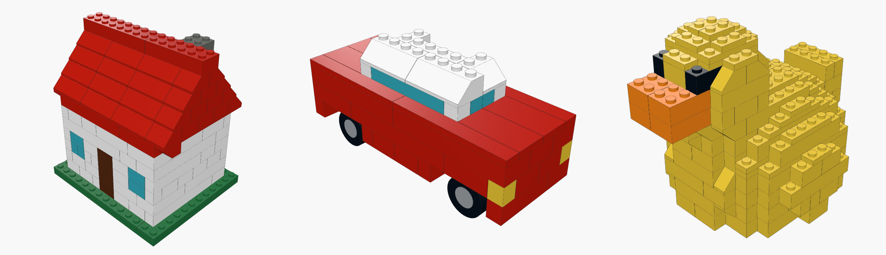
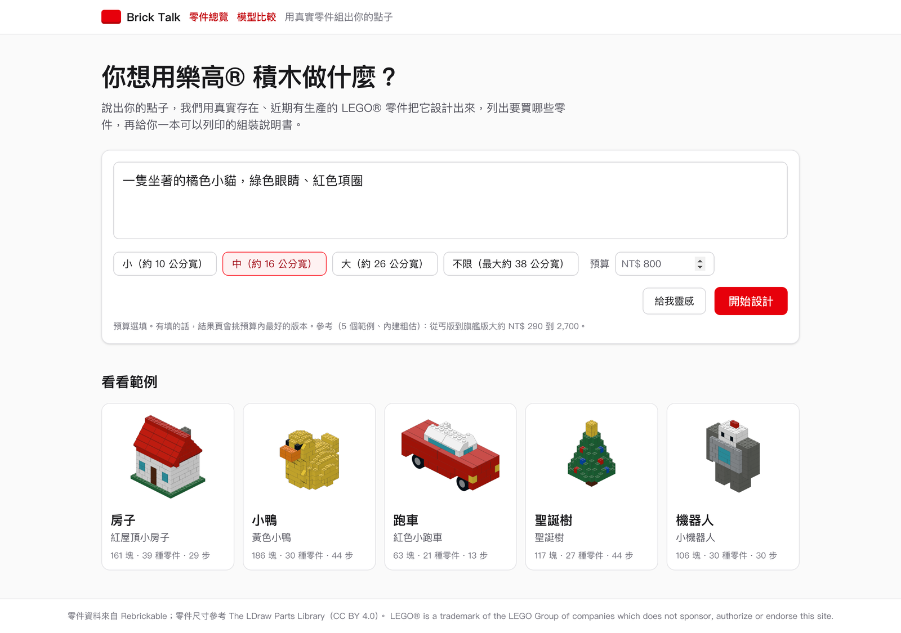
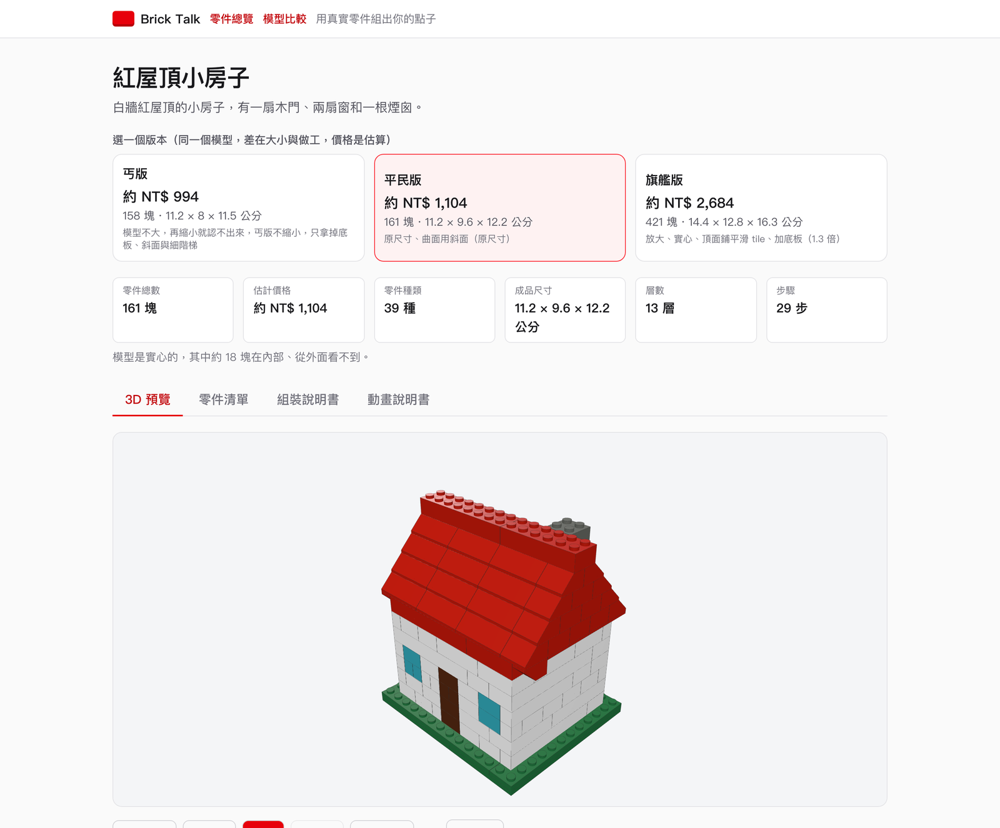
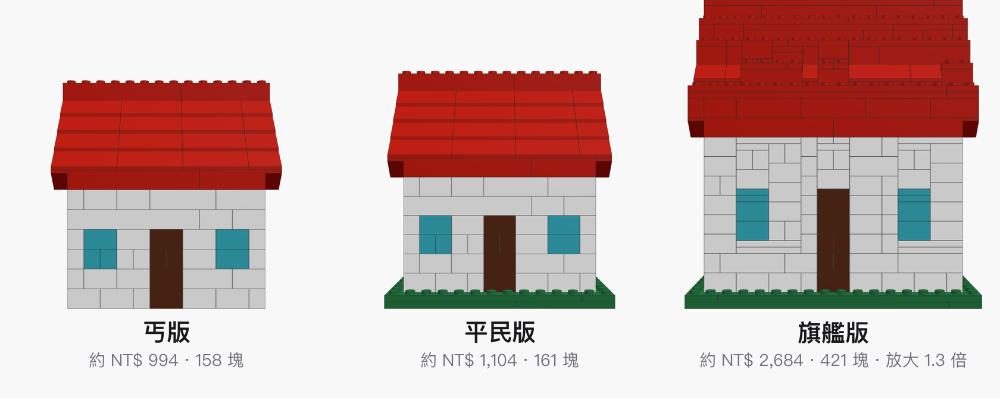
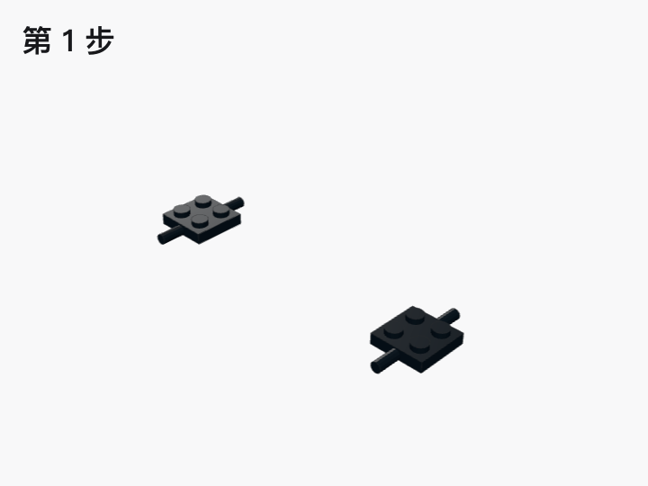
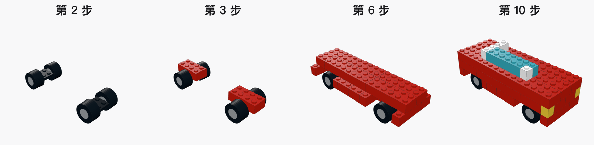
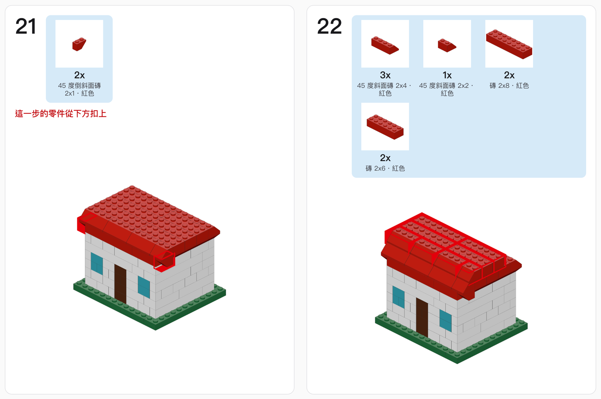
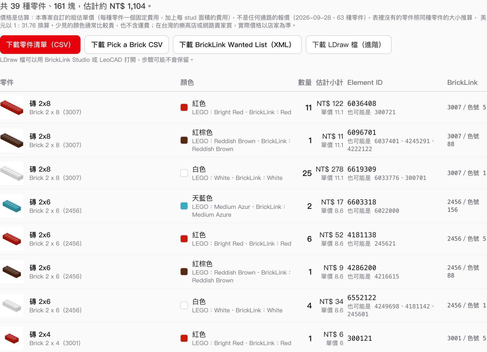
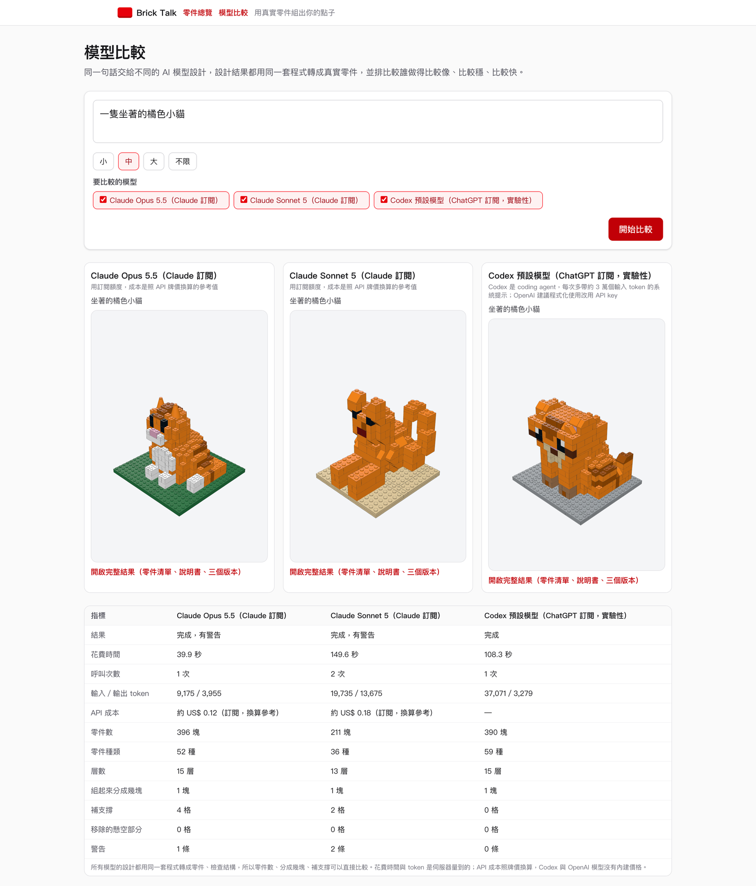

# Brick Talk

Describe what you want to build, and Brick Talk designs it with real, currently produced LEGO® parts: a 3D preview, a parts list you can order from BrickLink, a printable building booklet, and an animated step-by-step guide. The UI is in Traditional Chinese.



說一句想做的東西，例如「一隻紅色的小恐龍」，Brick Talk 會用真實存在、近期有生產的 LEGO® 零件把它設計出來。你會拿到 3D 模型、要買哪些零件、可以列印的組裝說明書，還有一步一步的組裝動畫。

## 功能介紹

### 說一句話就開始設計



輸入中文描述，選小、中、大、不限四種尺寸（「不限」最大約 38 公分見方），也可以先填預算。沒有點子的話按「給我靈感」，Claude 會提三個適合用樂高® 積木做的題目。首頁有 5 個示範模型（房子、小鴨、跑車、聖誕樹、機器人），不用設定任何 key 就能看。

### 用真實零件組出來



Claude 只負責決定「放幾個形狀、多大、放在哪」，轉成零件、檢查結構、排組裝步驟都由程式完成，同一份設計永遠產生同一組磚。零件除了一般的 brick，還有斜面與倒斜面（屋頂、車頭、曲面邊緣）、平滑的 tile、1x1 到 16x16 的 plate、圓磚、錐體和輪子組。高度以 1/3 層的 plate 為單位，球和圓柱的邊緣比較圓滑。程式會檢查每一塊磚有沒有扣在模型上，只從側面貼著的部位會讓磚跨進主體扣住，還是會分成好幾塊時會在結果頁警告。

### 同一個設計，三種價位



丐版縮小、只用一般磚、不加底板；平民版照原設計；旗艦版放大、頂面鋪平滑 tile、加底板。先給預算的話，結果頁會多一張「依預算」的卡片，挑預算內最好的版本。價格是估算，細節見下面的「價格資料」。

### 逐步組裝動畫



3D 預覽可以播放組裝過程，0.5x 到 4x 速度，每一步新的磚從上方落下。「動畫說明書」分頁一次看一步，列出這一步要拿的零件。



### 可以列印的組裝說明書



A4 說明書有封面、零件總表、每一步的零件 callout 與組裝圖（新加的磚有紅框）和完成圖，可以列印或存成 PDF。也可以只印零件總表帶去店裡。

### 零件清單與購買



每種零件列出尺寸、中文色名與 LEGO® 官方色名、Element ID、BrickLink 編號和估計小計。可以下載 CSV、Pick a Brick CSV、BrickLink Wanted List（XML）和 LDraw 檔。

### 模型比較



`/compare` 可以把同一句話同時交給好幾個 AI 模型設計。每個模型的設計都用同一套程式轉成真實零件、檢查結構，所以結果可以直接比：花了幾秒、呼叫幾次、用了多少 token、換算的 API 成本、幾塊零件、組起來會不會散、要補幾格支撐、估計價格。上圖是「一隻坐著的橘色小貓」（中尺寸）的實測：Claude Opus 5.5 最快（39.9 秒），Claude Sonnet 5 用的零件最少（211 塊）但重試了一次，Codex 不用補任何支撐。同一個模型每次結果也會不同，這只是一次的結果。

### 零件總覽

`/parts` 可以瀏覽 Rebrickable 目錄裡的全部零件（六萬多個），依分類篩選、用名稱或編號搜尋，看每個顏色的 Element ID。這一頁要先在本機產生零件資料庫，見下面的安裝說明。

## 用 AI 助理啟動

把下面這段貼給你的 AI 程式助理（例如 Claude Code），它會幫你把專案跑起來。沒有 Anthropic API key 也可以用，前提是你的電腦已經裝好並登入 Claude Code。

```text
幫我在這台電腦把 Brick Talk（https://github.com/aircon-chen/brick-talk）跑起來，只給我自己用。

1. 確認 Node.js 是 26 版以上、pnpm 是 10 版以上。沒有的話告訴我怎麼安裝，不要自己改系統設定。
2. clone 專案，在專案資料夾執行 pnpm install。
3. 設定 AI 設計功能，問我要用哪一種：
   - 有 Anthropic API key：請我自己把 ANTHROPIC_API_KEY=我的 key 寫進 .env.local。你不要讀取或印出 key。
   - 沒有 API key，但有 Claude Code：先用 claude -p "回覆 OK" 確認 claude 指令能用而且已經登入，再在 .env.local 寫入 LLM_BACKEND=claude-cli。
4. 執行 pnpm dev -H 127.0.0.1，確認 http://127.0.0.1:3000 的首頁打得開、範例模型看得到，再用「開始設計」試一個簡單的題目。
5. 如果我要零件總覽頁 /parts：照 data/catalog/README.md 下載 Rebrickable 的資料，再執行 python3 scripts/build_catalog.py --db-only。

不要 git push、不要部署，也不要把網站開放給其他人使用。
```

## 用 Docker 啟動

不想在電腦上裝 Node.js 的話，用 Docker 最省事。需要 Docker Desktop（本專案用 Docker 29、Docker Compose v5.5 測試過）。

```bash
git clone https://github.com/aircon-chen/brick-talk.git
cd brick-talk
cp .env.example .env        # 需要 AI 設計功能才填，不填也能用
docker compose up -d --build
```

打開 http://localhost:3000 。第一次 build 要下載套件，需要幾分鐘；第一次啟動會下載 Rebrickable 的資料、建立零件總覽頁的資料庫。

AI 設計功能在 `.env` 裡設定，三選一：

| 你有什麼 | `.env` 怎麼填 | 可以做什麼 |
|---|---|---|
| 什麼都沒有 | 不用填 | 看 5 個範例模型的 3D、零件清單、說明書、動畫 |
| Anthropic API key | `ANTHROPIC_API_KEY=你的 key` | 輸入描述讓 Claude 設計 |
| Claude Pro、Max、Team 或 Enterprise 訂閱 | 在自己的電腦執行 `claude setup-token`，把印出來的 token 填進 `CLAUDE_CODE_OAUTH_TOKEN=` | 用訂閱額度設計（token 有效一年） |

幾個替你想好的細節：

- 網站只綁在這台電腦上（`127.0.0.1`），同一個網路的其他人連不到。用 Claude 訂閱時只能自己用，這也是 Anthropic 的規定。
- `.env` 不會打包進映像檔，key 只在啟動時帶進容器。
- 零件資料存在 Docker volume，重新啟動不會再下載。不需要零件總覽頁的話，在 `.env` 設 `CATALOG_AUTO_BUILD=0`。
- 3000 port 被佔用時，在 `.env` 設 `BRICK_TALK_PORT=3001` 之類的其他 port。
- 容器用一般使用者身分執行，有健康檢查（`docker ps` 看得到狀態），程式意外結束時會自動重啟。

停止用 `docker compose down`；連零件資料一起刪掉用 `docker compose down -v`。映像檔約 1.5 GB。映像檔裡的 Claude Code 是 Anthropic 的專有授權軟體，請在自己的電腦 build 自己用，不要把 build 好的映像檔推到公開的 registry。

## 模型比較的設定

比較頁會列出這台電腦設定好的模型，在 `.env.local`（Docker 用 `.env`）設定：

| 模型 | 設定 | 說明 |
|---|---|---|
| Claude Opus 5.5、Claude Sonnet 5 | `ANTHROPIC_API_KEY=你的 key` | Anthropic API，照用量計費 |
| Claude Opus 5.5、Claude Sonnet 5（訂閱） | `LLM_BACKEND=claude-cli`，Docker 用 `CLAUDE_CODE_OAUTH_TOKEN` | 用你的 Claude 訂閱額度，只能自己用 |
| OpenAI 模型 | `OPENAI_API_KEY=你的 key`，要比哪些模型用 `OPENAI_MODELS=模型1,模型2`（預設 `gpt-6-astra`） | OpenAI Responses API，照用量計費 |
| Codex（ChatGPT 訂閱，實驗性） | `CODEX_CLI=1`，要指定模型用 `CODEX_MODEL` | 呼叫本機已登入的 Codex CLI，Docker 版沒有 |

Codex 這條路要特別說明：它在本機執行官方的 `codex exec`，用你登入 Codex 的 ChatGPT 帳號。OpenAI 的文件建議程式化使用 Codex 改用 API key，也沒有明確說明用 ChatGPT 訂閱從其他程式呼叫是否可以，所以標成實驗性，只建議自己在本機比較模型時用。Codex 是 coding agent，每次呼叫會多帶約 3 萬個輸入 token 的系統提示，token 數字不能跟直接呼叫模型的直接比。Codex 會用 shell 工具，所以程式讓它在一個只放了輸出格式檔的暫存目錄執行，並用 Codex 的權限設定禁止讀寫其他地方（實測讀不到家目錄與暫存目錄裡的檔案）。

用任何一種訂閱（Claude 或 ChatGPT）時，網站只給自己用：`pnpm dev -H 127.0.0.1` 或 Docker 版（只綁在這台電腦）。不加 `-H` 的 `pnpm dev` 同一個網路的人也連得到，會用掉你的額度。

比較頁裡每個模型最多等 5 分鐘（一般設計是 2 到 3 分鐘），因為模型的速度差很多：實測 Claude Sonnet 5 比 Opus 5.5 慢一倍以上。

## 安裝與啟動

需要 Node 26 與 pnpm 10。

```bash
pnpm install
pnpm dev          # http://localhost:3000
```

`pnpm install` 會順便建立價格檔（見「價格資料」）。零件總覽頁 `/parts` 要另外產生本機的零件目錄資料庫（約 30 MB，不在 repo 裡），步驟見 `data/catalog/README.md`；沒有的話其他功能照常，只有這一頁會顯示產生方式。

要讓 Claude 設計模型，在專案根目錄建立 `.env.local`，兩種方式選一種：

```text
# 方式一：Anthropic API key
ANTHROPIC_API_KEY=你的 key

# 方式二：沒有 API key，用這台電腦上 Claude Code 的登入（訂閱額度）
LLM_BACKEND=claude-cli
```

方式二是 server 端直接執行本機的 `claude -p`，帶 `--tools ""`（不給任何工具）、`--setting-sources ""`（不載入你的 settings、hooks、CLAUDE.md）、`--strict-mcp-config`（不載入 MCP 工具定義，不然每次多送數萬個 token）、`--json-schema`（強制輸出格式）。它用的是登入這台電腦的那個人的訂閱額度，只適合自己在本機用。Anthropic 不允許第三方產品提供 claude.ai 登入給別人用（見 [Agent SDK 文件](https://code.claude.com/docs/en/agent-sdk/overview)），所以不要部署給別人用。`pnpm dev` 預設也聽區網，同一個 Wi-Fi 的人連得到，要只給自己用就改成 `pnpm dev -H 127.0.0.1`。兩個都有設的時候用 API key。

沒有 key 也沒開方式二時，首頁的範例模型照常可用，「開始設計」會提示還沒設定 key。設計用 `claude-opus-5-5`，點子模式用 `claude-sonnet-5`，要換模型改 `src/llm/models.ts`。

## 指令

| 指令 | 做什麼 |
|---|---|
| `pnpm dev` | 開發模式 |
| `pnpm build` / `pnpm start` | 正式 build 與啟動 |
| `pnpm lint` | ESLint |
| `pnpm test` | 單元測試（vitest） |
| `pnpm e2e` | 端對端測試（Playwright，會自己 build 並用 mock LLM 在 port 3100 啟動） |
| `pnpm palette` | 從 `data/catalog/palette.json` 重新產生 `src/core/palette.data.json` |

第一次跑 e2e 前要裝瀏覽器：`pnpm exec playwright install chromium`。

## 運作方式

```text
使用者描述
  → Claude 輸出基本形狀組合（ModelSpec JSON：box、ellipsoid、cylinder、cells，每個形狀有 top 頂面處理，另外有 parts 特殊零件）
  → 正規化與驗證（src/core/spec.ts）
  → 體素化，高度以 plate 為單位（voxelize.ts：曲面下緣對齊整層、上緣保留 1/3 層；輪子組會在車身挖出輪拱；底板鋪在最下面兩片）
  → 合併成真實的零件（legolize.ts：先放底板、圓磚、錐體、輪軸座，每層先放斜面與倒斜面，每個位置先試 brick、放不下才用 plate，其餘錯縫排 brick）
  → 接地檢查與補支撐（support.ts：斜面讓模型斷開就換回一般磚重組；只從側面貼著主體的部位，把主體裡相鄰的格子改成同色讓磚跨進去扣住，還是不行才補支撐柱）
  → 補上不占格子的零件（extras.ts：頂面 tile、掛在輪軸座上的輪框與輪胎）
  → 分步（steps.ts：由下往上，吊掛的磚另外一步，輪子在輪軸座之後一步）
  → 零件清單、估計價格與匯出（bom.ts、price.ts、ldraw.ts）
  → 3D 預覽與說明書（src/render/）
```

LLM 只負責「放幾個形狀、多大、在哪」，座標運算和轉成磚都是確定性的程式碼，同一份設計永遠產生同一組磚和步驟。演算法的規格與實測數字在 `SUPERPROMPT.md` 第 7 節與附錄 B，參考實作在 `docs/reference/`。

## 目錄結構

```text
src/core/        純 TypeScript 的核心（不依賴 React、three.js、DOM）：palette、spec、voxelize、legolize、support、steps、bom、ldraw、pipeline
src/fixtures/    5 個示範模型
src/llm/         system prompt、設計流程（重試、品質回饋、deadline）、SDK 包裝、mock、點子模式
src/render/      three.js 幾何、場景、說明書截圖
src/components/  頁面元件
src/app/         Next.js 頁面與 API route（/api/design、/api/ideas、/parts 零件總覽）
src/lib/         瀏覽器端儲存、呼叫 API、零件目錄查詢（catalog.ts，server 端讀 SQLite）
e2e/             Playwright 測試
data/catalog/    零件目錄（見下一節）
docs/            研究筆記、參考實作、交接檔
scripts/         重建零件目錄的腳本
```

## 零件目錄

`data/catalog/` 是 LEGO 零件的完整目錄，加上 builder 用的精選零件表。詳細說明在 `data/catalog/README.md`。

| 檔案 | 內容 |
|---|---|
| `lego_catalog.sqlite` | 64,664 個零件、275 種顏色、114,315 筆 Element ID、109,501 個零件加顏色組合（含出現年份與照片網址） |
| `parts_all.csv` / `colors_all.csv` | 全部零件與顏色的一覽表 |
| `palette.json` | builder 用的 63 種零件（41 種 brick、plate、tile、斜面磚，7 種特殊零件：輪軸座、輪框、輪胎、圓磚、錐體，15 種 1x10 到 16x16 的大片 plate）乘上顏色，含 Element ID 與 Rebrickable、LDraw、BrickLink、LEGO 四套色號對照 |

涵蓋範圍的限制：尺寸是從零件名稱解析的，64,664 個零件裡有 21,090 個解析得出尺寸；Rebrickable 資料沒有幾何，形狀只能靠名稱、分類與照片網址。`sqlite` 與 `parts_all.csv` 太大，沒有進 git，照 `data/catalog/README.md` 的步驟可以重建。

查詢範例：

```bash
sqlite3 data/catalog/lego_catalog.sqlite \
  "SELECT pc.element_ids, pc.num_sets, pc.y2 FROM part_colors pc JOIN colors c ON c.id = pc.color_id
   WHERE pc.part_num = '3001' AND c.name = 'Red';"
# 300121|1071|2026
```

## 買零件要注意

- 「近期有生產」是根據 2024 年以後發行的套組推估，LEGO 沒有公開生產狀態，實際能不能買以各通路當下頁面為準。
- Pick a Brick 的批次上傳（CSV）在 2024 年上線時只開放美國、加拿大，這裡匯出的格式照公開資料製作，還沒實測。台灣能不能在 LEGO 官網下單還沒確認。
- BrickLink XML 可以直接上傳到 Wanted List，用的是 BrickLink 自己的零件編號與色號。

## 價格資料

程式讀 `src/core/price.data.json`。這個檔不在版控裡，`pnpm install` 時如果沒有，會從 `src/core/price.default.json`（本專案自訂的粗估：每種零件一個固定費用，加上每 stud 面積的費用）複製一份。想用自己的價格，直接覆蓋 `price.data.json`，格式跟 `price.default.json` 一樣，表裡沒有的零件會照同種零件的面積內插。單元測試固定用 `price.default.json`。

## 資料來源與授權

- 程式碼：MIT License，見 `LICENSE`。
- 零件、顏色、Element ID：[Rebrickable](https://rebrickable.com/downloads/) 的 CSV dump。Rebrickable 允許任何用途使用，條件是註明資料來源是 Rebrickable。
- 零件幾何與色碼：The LDraw Parts Library（[library.ldraw.org](https://library.ldraw.org/)），CC BY 4.0。
- BrickLink 的條款不允許散布它的資料，所以 BrickLink 色表與價格不在 repo 裡。BrickLink 的零件編號與色號改從 Rebrickable API 取得（重建 palette 時要設 `REBRICKABLE_API_KEY`），見 `data/catalog/README.md`。
- LEGO® is a trademark of the LEGO Group of companies which does not sponsor, authorize or endorse this site. 這個專案跟 LEGO Group 沒有關係。
